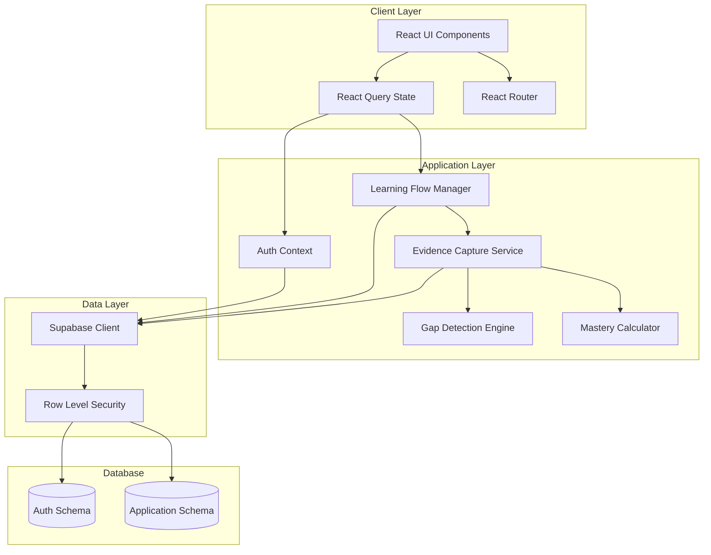
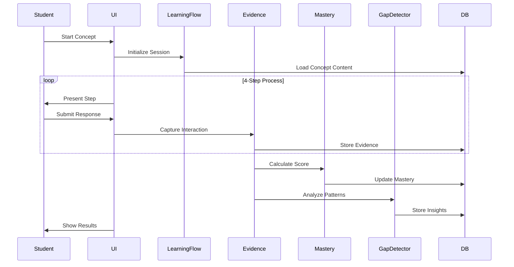

# Design Document: EduTrace

## Overview

EduTrace is an evidence-based personalized learning intelligence platform built with React, TypeScript, and Supabase. The system measures learning and thinking processes rather than just marks, using a concept-based approach with a structured 4-step learning flow. The platform captures comprehensive evidence of student interactions, detects concept gaps using rule-based analysis, and provides actionable insights for teachers.

### Core Design Principles

1. **Evidence-Driven**: Every student interaction generates evidence that informs mastery scoring and gap detection
2. **Concept-Based Learning**: Learning is organized around discrete concepts with prerequisite relationships, not chapters
3. **Metacognitive Focus**: Mandatory reflection steps develop student self-awareness
4. **Rule-Based Intelligence**: Automated gap detection using deterministic rules (no ML required)
5. **Teacher Insight Focus**: Analytics designed to reveal learning behaviors and patterns, not just performance metrics

### Technology Stack

- **Frontend**: React 18 + TypeScript + Vite
- **UI Components**: shadcn/ui (Radix UI primitives)
- **Styling**: Tailwind CSS
- **Backend**: Supabase (PostgreSQL + Auth + RLS)
- **State Management**: React Query (@tanstack/react-query)
- **Routing**: React Router v6
- **Form Handling**: React Hook Form + Zod validation
- **Testing**: Vitest + Testing Library

## Architecture

### System Architecture



### Data Flow Architecture




## Components and Interfaces

### Authentication System

**Components:**
- `AuthProvider`: Context provider managing authentication state
- `LoginForm`: Email/password authentication UI
- `RoleBasedRoute`: Route guard component checking user role
- `useAuth`: Hook exposing authentication state and methods

**Interfaces:**
```typescript
interface AuthContext {
  user: User | null;
  role: UserRole | null;
  loading: boolean;
  signIn: (email: string, password: string) => Promise<void>;
  signOut: () => Promise<void>;
  signUp: (email: string, password: string, role: UserRole, fullName: string) => Promise<void>;
}

interface User {
  id: string;
  email: string;
  fullName: string;
  avatarUrl?: string;
}

type UserRole = 'student' | 'teacher' | 'admin';
```

### Learning Flow Manager

**Components:**
- `ConceptLearningFlow`: Main component orchestrating the 4-step process
- `StepExplanation`: Displays concept explanation with optional diagrams
- `StepThinkingTask`: Presents written-answer question with timer
- `StepReflection`: Mandatory reflection form with confidence rating
- `StepMicroApplication`: Small application task
- `LearningSessionProvider`: Context managing current session state

**Interfaces:**
```typescript
interface LearningSession {
  conceptId: string;
  step: 'explanation' | 'thinking' | 'reflection' | 'application' | 'complete';
  startTime: Date;
  evidence: Partial<LearningEvidence>;
}

interface ConceptContent {
  conceptId: string;
  explanation: string;
  imageUrl?: string;
  thinkingTask: ThinkingTask;
  reflectionPrompts: string[];
  microApplication: MicroApplication;
}

interface ThinkingTask {
  id: string;
  type: 'predict' | 'explain' | 'fix' | 'compare';
  prompt: string;
  context?: string;
  expectedInsights: string[];
}

interface MicroApplication {
  id: string;
  prompt: string;
  context?: string;
  rubric: string[];
}
```

**Flow Control:**
1. Step transitions are enforced sequentially
2. Each step completion triggers evidence capture
3. Session state persists in React context
4. Timer starts on step mount, stops on submission
5. Reflection is mandatory - cannot skip to application

### Evidence Capture Service

**Components:**
- `EvidenceCapture`: Service class handling all evidence operations
- `useEvidenceCapture`: Hook for capturing evidence from components
- `TimerHook`: Custom hook tracking time spent on tasks

**Interfaces:**
```typescript
interface LearningEvidence {
  id: string;
  studentId: string;
  conceptId: string;
  timestamp: Date;
  
  // Thinking Task Evidence
  thinkingAnswer: string;
  thinkingTimeSeconds: number;
  thinkingAttempts: number;
  thinkingCorrectness: 'correct' | 'partial' | 'incorrect';
  
  // Reflection Evidence
  confusionPoint: string;
  mistakeDescription: string;
  confidenceScore: 1 | 2 | 3 | 4 | 5;
  
  // Micro Application Evidence
  applicationAnswer: string;
  applicationTimeSeconds: number;
  applicationCorrectness: 'correct' | 'partial' | 'incorrect';
}

interface EvidenceCaptureService {
  captureThinkingTask(
    studentId: string,
    conceptId: string,
    answer: string,
    timeSeconds: number,
    attempts: number,
    correctness: Correctness
  ): Promise<void>;
  
  captureReflection(
    evidenceId: string,
    confusion: string,
    mistakes: string,
    confidence: 1 | 2 | 3 | 4 | 5
  ): Promise<void>;
  
  captureApplication(
    evidenceId: string,
    answer: string,
    timeSeconds: number,
    correctness: Correctness
  ): Promise<void>;
}
```

**Evidence Storage Strategy:**
- Create evidence record on thinking task submission
- Update same record with reflection data
- Update again with application data
- All updates include timestamp for audit trail
- Evidence is immutable after session completion


### Concept Mastery Calculator

**Components:**
- `MasteryCalculator`: Service calculating mastery scores
- `useMastery`: Hook for accessing mastery data
- `MasteryBadge`: UI component displaying mastery level

**Interfaces:**
```typescript
interface ConceptMastery {
  studentId: string;
  conceptId: string;
  masteryScore: number; // 0-100
  masteryLevel: MasteryLevel;
  lastUpdated: Date;
  evidenceCount: number;
  trend: 'improving' | 'stable' | 'declining';
}

type MasteryLevel = 'expert' | 'proficient' | 'developing' | 'emerging' | 'novice';

interface MasteryCalculator {
  calculateMastery(evidence: LearningEvidence[]): number;
  getMasteryLevel(score: number): MasteryLevel;
  getTrend(currentScore: number, previousScores: number[]): 'improving' | 'stable' | 'declining';
}
```

**Mastery Calculation Algorithm:**

```
masteryScore = (
  accuracyScore * 0.40 +
  confidenceAlignmentScore * 0.25 +
  improvementScore * 0.20 +
  explanationQualityScore * 0.15
)

where:
  accuracyScore = average correctness across all evidence
    - correct = 100
    - partial = 50
    - incorrect = 0
  
  confidenceAlignmentScore = alignment between confidence and correctness
    - perfect alignment (high confidence + correct OR low confidence + incorrect) = 100
    - misalignment (high confidence + incorrect OR low confidence + correct) = 0
    - calculate as: 100 - abs(normalizedConfidence - normalizedCorrectness)
  
  improvementScore = trend over time
    - compare recent 3 attempts vs previous 3 attempts
    - improving = 100, stable = 70, declining = 40
  
  explanationQualityScore = quality of written answers
    - length > 50 chars = +30
    - contains reasoning keywords (because, therefore, since) = +30
    - addresses the prompt directly = +40
```

**Mastery Level Thresholds:**
- Expert: 90-100
- Proficient: 75-89
- Developing: 55-74
- Emerging: 35-54
- Novice: 0-34

### Gap Detection Engine

**Components:**
- `GapDetector`: Service analyzing evidence patterns
- `useGapInsights`: Hook for accessing detected gaps
- `GapInsightCard`: UI component displaying gap information

**Interfaces:**
```typescript
interface GapInsight {
  id: string;
  studentId: string;
  conceptId: string;
  type: 'fragile_understanding' | 'misconception' | 'missing_prerequisite' | 'false_confidence';
  description: string;
  severity: 'low' | 'medium' | 'high';
  suggestedAction: string;
  detectedAt: Date;
}

interface GapDetector {
  detectFragileUnderstanding(evidence: LearningEvidence[]): GapInsight | null;
  detectMisconception(evidence: LearningEvidence[]): GapInsight | null;
  detectMissingPrerequisite(conceptId: string, mastery: ConceptMastery[]): GapInsight | null;
  detectFalseConfidence(evidence: LearningEvidence[]): GapInsight | null;
  analyzeAll(studentId: string, conceptId: string): Promise<GapInsight[]>;
}
```

**Gap Detection Rules:**

1. **Fragile Understanding**
   - Trigger: Correct answer + confidence ≤ 2
   - Severity: Low
   - Action: "Additional practice to build confidence"

2. **Misconception**
   - Trigger: Same mistake pattern in ≥ 3 attempts
   - Severity: Medium to High (based on frequency)
   - Action: "Targeted intervention on specific misconception"
   - Pattern detection: Compare answer text similarity using Levenshtein distance

3. **Missing Prerequisite**
   - Trigger: Advanced concept mastery < 50 AND prerequisite mastery < 60
   - Severity: High
   - Action: "Review prerequisite concept: [concept name]"

4. **False Confidence**
   - Trigger: Incorrect answer + confidence ≥ 4
   - Severity: High
   - Action: "Provide feedback challenging assumptions"

**Detection Frequency:**
- Run after each evidence capture
- Batch analysis nightly for all students
- Store only new insights (deduplicate by type + concept + student)


### Student Dashboard Components

**Components:**
- `StudentDashboard`: Main dashboard with subject cards
- `SubjectCard`: Displays subject with progress indicator
- `ConceptList`: Lists concepts with mastery scores
- `ProgressChart`: Visualizes progress trends over time
- `StrengthsWeaknesses`: Shows top/bottom concepts

**Interfaces:**
```typescript
interface StudentProgress {
  student: User;
  overallMastery: number;
  conceptsMastered: number;
  totalConcepts: number;
  strengths: Array<{ concept: Concept; mastery: number }>;
  weaknesses: Array<{ concept: Concept; mastery: number }>;
  recentActivity: LearningEvidence[];
  gapInsights: GapInsight[];
}

interface SubjectProgress {
  subject: Subject;
  conceptCount: number;
  completedCount: number;
  averageMastery: number;
  concepts: Array<{
    concept: Concept;
    mastery: ConceptMastery | null;
    isLocked: boolean;
  }>;
}
```

**Dashboard Layout:**
- 6 subject cards (Telugu, English, Mathematics, Physics, Chemistry, Computer/Coding)
- Each card shows: subject name, icon, progress percentage, average mastery
- Click subject → navigate to concept list
- Sidebar shows: overall progress, strengths, weaknesses, recent insights

### Teacher Analytics Components

**Components:**
- `TeacherDashboard`: Class overview with key metrics
- `ConceptHeatmap`: Grid showing student × concept mastery
- `StudentBehaviorAnalysis`: Detailed student learning patterns
- `ClassInsightsPanel`: Aggregated insights and recommendations
- `EffortPerformanceChart`: Scatter plot of time vs mastery

**Interfaces:**
```typescript
interface ClassInsights {
  classId: string;
  className: string;
  studentCount: number;
  averageMastery: number;
  weakConcepts: Array<{
    concept: Concept;
    averageMastery: number;
    studentCount: number;
  }>;
  studentsNeedingAttention: Array<{
    student: User;
    reason: string;
    urgency: 'low' | 'medium' | 'high';
  }>;
  conceptHeatmap: Array<{
    conceptId: string;
    studentId: string;
    mastery: number;
  }>;
}

interface StudentBehaviorProfile {
  studentId: string;
  learningStyle: 'logical' | 'memorization' | 'mixed';
  workEthic: 'hard_worker' | 'struggler' | 'coasting';
  confidenceCalibration: 'well_calibrated' | 'overconfident' | 'underconfident';
  averageTimePerConcept: number;
  classAverageTime: number;
  improvementRate: number;
  gapCount: number;
}
```

**Teacher Analytics Features:**

1. **Concept Heatmap**
   - Rows: Students
   - Columns: Concepts
   - Color: Mastery level (red → yellow → green)
   - Click cell → view student's evidence for that concept

2. **Weakest Concepts**
   - Sort concepts by average class mastery
   - Show student count struggling with each
   - Suggest class-wide interventions

3. **Student Behavior Detection**
   - Logical understanding: High mastery + good explanation quality
   - Memorization: High accuracy + low confidence alignment
   - Hard worker: High time investment + improving trend
   - Struggler: High time investment + low mastery
   - Silently weak: Appears fine but has hidden gaps (fragile understanding)

4. **Effort vs Performance**
   - X-axis: Average time per concept
   - Y-axis: Average mastery
   - Quadrants:
     - High effort, high mastery: Hard workers
     - High effort, low mastery: Strugglers (need help)
     - Low effort, high mastery: Natural talent
     - Low effort, low mastery: Disengaged (need motivation)

### Admin Management Components

**Components:**
- `AdminDashboard`: Platform overview
- `ClassManagement`: Create/edit classes
- `UserManagement`: Add students/teachers to classes
- `SubjectManagement`: Configure subjects and concepts
- `PlatformAnalytics`: Overall usage and performance metrics

**Interfaces:**
```typescript
interface Class {
  id: string;
  name: string;
  teacherId: string;
  studentIds: string[];
  subjectIds: string[];
  createdAt: Date;
}

interface Subject {
  id: string;
  name: string;
  description: string;
  iconName: string;
  color: string;
}

interface Concept {
  id: string;
  subjectId: string;
  name: string;
  description: string;
  prerequisiteIds: string[];
  order: number;
  estimatedMinutes: number;
}
```


## Data Models

### Database Schema

```sql
-- Existing tables (from migration)
-- profiles: user_id, full_name, avatar_url, created_at, updated_at
-- user_roles: user_id, role (student/teacher/admin)

-- Classes
CREATE TABLE classes (
  id UUID PRIMARY KEY DEFAULT gen_random_uuid(),
  name TEXT NOT NULL,
  teacher_id UUID REFERENCES auth.users(id) ON DELETE SET NULL,
  created_at TIMESTAMPTZ NOT NULL DEFAULT now(),
  updated_at TIMESTAMPTZ NOT NULL DEFAULT now()
);

-- Class Memberships
CREATE TABLE class_memberships (
  id UUID PRIMARY KEY DEFAULT gen_random_uuid(),
  class_id UUID REFERENCES classes(id) ON DELETE CASCADE NOT NULL,
  student_id UUID REFERENCES auth.users(id) ON DELETE CASCADE NOT NULL,
  joined_at TIMESTAMPTZ NOT NULL DEFAULT now(),
  UNIQUE(class_id, student_id)
);

-- Subjects
CREATE TABLE subjects (
  id UUID PRIMARY KEY DEFAULT gen_random_uuid(),
  name TEXT NOT NULL UNIQUE,
  description TEXT,
  icon_name TEXT NOT NULL,
  color TEXT NOT NULL,
  created_at TIMESTAMPTZ NOT NULL DEFAULT now()
);

-- Concepts
CREATE TABLE concepts (
  id UUID PRIMARY KEY DEFAULT gen_random_uuid(),
  subject_id UUID REFERENCES subjects(id) ON DELETE CASCADE NOT NULL,
  name TEXT NOT NULL,
  description TEXT,
  order_index INTEGER NOT NULL,
  estimated_minutes INTEGER NOT NULL,
  created_at TIMESTAMPTZ NOT NULL DEFAULT now(),
  UNIQUE(subject_id, order_index)
);

-- Concept Prerequisites
CREATE TABLE concept_prerequisites (
  concept_id UUID REFERENCES concepts(id) ON DELETE CASCADE NOT NULL,
  prerequisite_id UUID REFERENCES concepts(id) ON DELETE CASCADE NOT NULL,
  PRIMARY KEY (concept_id, prerequisite_id),
  CHECK (concept_id != prerequisite_id)
);

-- Concept Content
CREATE TABLE concept_contents (
  concept_id UUID PRIMARY KEY REFERENCES concepts(id) ON DELETE CASCADE,
  explanation TEXT NOT NULL,
  image_url TEXT,
  thinking_task_type TEXT NOT NULL CHECK (thinking_task_type IN ('predict', 'explain', 'fix', 'compare')),
  thinking_task_prompt TEXT NOT NULL,
  thinking_task_context TEXT,
  thinking_task_insights JSONB NOT NULL,
  reflection_prompts JSONB NOT NULL,
  micro_app_prompt TEXT NOT NULL,
  micro_app_context TEXT,
  micro_app_rubric JSONB NOT NULL,
  created_at TIMESTAMPTZ NOT NULL DEFAULT now(),
  updated_at TIMESTAMPTZ NOT NULL DEFAULT now()
);

-- Learning Evidence
CREATE TABLE learning_evidence (
  id UUID PRIMARY KEY DEFAULT gen_random_uuid(),
  student_id UUID REFERENCES auth.users(id) ON DELETE CASCADE NOT NULL,
  concept_id UUID REFERENCES concepts(id) ON DELETE CASCADE NOT NULL,
  
  -- Thinking Task Evidence
  thinking_answer TEXT NOT NULL,
  thinking_time_seconds INTEGER NOT NULL,
  thinking_attempts INTEGER NOT NULL DEFAULT 1,
  thinking_correctness TEXT NOT NULL CHECK (thinking_correctness IN ('correct', 'partial', 'incorrect')),
  
  -- Reflection Evidence
  confusion_point TEXT NOT NULL,
  mistake_description TEXT NOT NULL,
  confidence_score INTEGER NOT NULL CHECK (confidence_score BETWEEN 1 AND 5),
  
  -- Micro Application Evidence
  application_answer TEXT NOT NULL,
  application_time_seconds INTEGER NOT NULL,
  application_correctness TEXT NOT NULL CHECK (application_correctness IN ('correct', 'partial', 'incorrect')),
  
  created_at TIMESTAMPTZ NOT NULL DEFAULT now()
);

-- Concept Mastery
CREATE TABLE concept_mastery (
  student_id UUID REFERENCES auth.users(id) ON DELETE CASCADE NOT NULL,
  concept_id UUID REFERENCES concepts(id) ON DELETE CASCADE NOT NULL,
  mastery_score INTEGER NOT NULL CHECK (mastery_score BETWEEN 0 AND 100),
  mastery_level TEXT NOT NULL CHECK (mastery_level IN ('expert', 'proficient', 'developing', 'emerging', 'novice')),
  evidence_count INTEGER NOT NULL DEFAULT 0,
  trend TEXT NOT NULL CHECK (trend IN ('improving', 'stable', 'declining')),
  last_updated TIMESTAMPTZ NOT NULL DEFAULT now(),
  PRIMARY KEY (student_id, concept_id)
);

-- Gap Insights
CREATE TABLE gap_insights (
  id UUID PRIMARY KEY DEFAULT gen_random_uuid(),
  student_id UUID REFERENCES auth.users(id) ON DELETE CASCADE NOT NULL,
  concept_id UUID REFERENCES concepts(id) ON DELETE CASCADE NOT NULL,
  gap_type TEXT NOT NULL CHECK (gap_type IN ('fragile_understanding', 'misconception', 'missing_prerequisite', 'false_confidence')),
  description TEXT NOT NULL,
  severity TEXT NOT NULL CHECK (severity IN ('low', 'medium', 'high')),
  suggested_action TEXT NOT NULL,
  detected_at TIMESTAMPTZ NOT NULL DEFAULT now(),
  resolved_at TIMESTAMPTZ,
  UNIQUE(student_id, concept_id, gap_type, detected_at)
);

-- Indexes for performance
CREATE INDEX idx_learning_evidence_student ON learning_evidence(student_id);
CREATE INDEX idx_learning_evidence_concept ON learning_evidence(concept_id);
CREATE INDEX idx_learning_evidence_created ON learning_evidence(created_at DESC);
CREATE INDEX idx_concept_mastery_student ON concept_mastery(student_id);
CREATE INDEX idx_gap_insights_student ON gap_insights(student_id);
CREATE INDEX idx_gap_insights_unresolved ON gap_insights(student_id, concept_id) WHERE resolved_at IS NULL;
```

### Row Level Security Policies

```sql
-- Students can only view their own evidence and mastery
CREATE POLICY "Students view own evidence"
ON learning_evidence FOR SELECT
USING (auth.uid() = student_id);

CREATE POLICY "Students view own mastery"
ON concept_mastery FOR SELECT
USING (auth.uid() = student_id);

CREATE POLICY "Students view own gaps"
ON gap_insights FOR SELECT
USING (auth.uid() = student_id);

-- Teachers can view evidence for students in their classes
CREATE POLICY "Teachers view class evidence"
ON learning_evidence FOR SELECT
USING (
  EXISTS (
    SELECT 1 FROM class_memberships cm
    JOIN classes c ON c.id = cm.class_id
    WHERE cm.student_id = learning_evidence.student_id
    AND c.teacher_id = auth.uid()
  )
);

CREATE POLICY "Teachers view class mastery"
ON concept_mastery FOR SELECT
USING (
  EXISTS (
    SELECT 1 FROM class_memberships cm
    JOIN classes c ON c.id = cm.class_id
    WHERE cm.student_id = concept_mastery.student_id
    AND c.teacher_id = auth.uid()
  )
);

-- Admins can view everything
CREATE POLICY "Admins view all"
ON learning_evidence FOR SELECT
USING (public.has_role(auth.uid(), 'admin'));

-- All authenticated users can view subjects and concepts
CREATE POLICY "All users view subjects"
ON subjects FOR SELECT
USING (auth.uid() IS NOT NULL);

CREATE POLICY "All users view concepts"
ON concepts FOR SELECT
USING (auth.uid() IS NOT NULL);

CREATE POLICY "All users view concept content"
ON concept_contents FOR SELECT
USING (auth.uid() IS NOT NULL);
```

### TypeScript Type Definitions

```typescript
// Core domain types
export type UserRole = 'student' | 'teacher' | 'admin';
export type Correctness = 'correct' | 'partial' | 'incorrect';
export type MasteryLevel = 'expert' | 'proficient' | 'developing' | 'emerging' | 'novice';
export type Trend = 'improving' | 'stable' | 'declining';
export type GapType = 'fragile_understanding' | 'misconception' | 'missing_prerequisite' | 'false_confidence';
export type Severity = 'low' | 'medium' | 'high';
export type ThinkingTaskType = 'predict' | 'explain' | 'fix' | 'compare';
export type LearningStep = 'explanation' | 'thinking' | 'reflection' | 'application' | 'complete';

// Database row types (matching schema)
export interface ProfileRow {
  id: string;
  user_id: string;
  full_name: string;
  avatar_url: string | null;
  created_at: string;
  updated_at: string;
}

export interface UserRoleRow {
  id: string;
  user_id: string;
  role: UserRole;
  created_at: string;
}

export interface ClassRow {
  id: string;
  name: string;
  teacher_id: string | null;
  created_at: string;
  updated_at: string;
}

export interface SubjectRow {
  id: string;
  name: string;
  description: string | null;
  icon_name: string;
  color: string;
  created_at: string;
}

export interface ConceptRow {
  id: string;
  subject_id: string;
  name: string;
  description: string | null;
  order_index: number;
  estimated_minutes: number;
  created_at: string;
}

export interface LearningEvidenceRow {
  id: string;
  student_id: string;
  concept_id: string;
  thinking_answer: string;
  thinking_time_seconds: number;
  thinking_attempts: number;
  thinking_correctness: Correctness;
  confusion_point: string;
  mistake_description: string;
  confidence_score: 1 | 2 | 3 | 4 | 5;
  application_answer: string;
  application_time_seconds: number;
  application_correctness: Correctness;
  created_at: string;
}

export interface ConceptMasteryRow {
  student_id: string;
  concept_id: string;
  mastery_score: number;
  mastery_level: MasteryLevel;
  evidence_count: number;
  trend: Trend;
  last_updated: string;
}

export interface GapInsightRow {
  id: string;
  student_id: string;
  concept_id: string;
  gap_type: GapType;
  description: string;
  severity: Severity;
  suggested_action: string;
  detected_at: string;
  resolved_at: string | null;
}
```


## Correctness Properties

A property is a characteristic or behavior that should hold true across all valid executions of a system—essentially, a formal statement about what the system should do. Properties serve as the bridge between human-readable specifications and machine-verifiable correctness guarantees.

### Authentication and Authorization Properties

**Property 1: Valid Authentication Success**
*For any* valid email and password credentials with an assigned role, authentication should succeed and return the correct user role.
**Validates: Requirements 1.1**

**Property 2: Role-Based Routing**
*For any* authenticated user, the system should route to the dashboard corresponding to their role (student → /student, teacher → /teacher, admin → /admin).
**Validates: Requirements 1.2**

**Property 3: Invalid Authentication Rejection**
*For any* invalid credentials (wrong password, non-existent email, or malformed input), authentication should fail and return an error.
**Validates: Requirements 1.3**

### Learning Flow Properties

**Property 4: Sequential Step Enforcement**
*For any* concept learning session, steps must be completed in order (explanation → thinking → reflection → application), and no step can be skipped or accessed out of sequence.
**Validates: Requirements 2.2, 2.4, 2.5, 2.6**

**Property 5: Thinking Task Format Constraint**
*For any* thinking task in the system, it must require a written answer and must not be a multiple-choice question.
**Validates: Requirements 2.3**

**Property 6: Mandatory Reflection**
*For any* thinking task submission, the system must require reflection completion before allowing progression to the application step.
**Validates: Requirements 2.4, 9.1, 9.5**

**Property 7: Mastery Update on Completion**
*For any* completed 4-step learning session, the concept mastery score must be calculated and updated immediately.
**Validates: Requirements 2.7, 4.6**

### Evidence Capture Properties

**Property 8: Complete Evidence Capture**
*For any* learning session, all evidence fields must be captured and stored: thinking answer, thinking time, attempts, thinking correctness, confusion point, mistake description, confidence score, application answer, application time, and application correctness.
**Validates: Requirements 3.1, 3.2, 3.3, 3.4, 3.5, 3.6**

**Property 9: Evidence Association**
*For any* captured evidence, it must be associated with the correct student ID, concept ID, and timestamp.
**Validates: Requirements 3.7**

**Property 10: Evidence Persistence Round Trip**
*For any* evidence captured and stored, retrieving it from the database should return data equivalent to what was stored.
**Validates: Requirements 16.1, 16.2, 16.5**

### Mastery Calculation Properties

**Property 11: Mastery Score Bounds**
*For any* calculated concept mastery score, it must be a value between 0 and 100 (inclusive).
**Validates: Requirements 4.5**

**Property 12: Mastery Factors Influence**
*For any* two sets of evidence where one has higher accuracy, better confidence alignment, more improvement, or better explanation quality, the mastery score should reflect these differences (higher factors → higher score).
**Validates: Requirements 4.1, 4.2, 4.3, 4.4**

**Property 13: Mastery Level Consistency**
*For any* mastery score, the assigned mastery level must match the defined thresholds: expert (90-100), proficient (75-89), developing (55-74), emerging (35-54), novice (0-34).
**Validates: Requirements 4.5**

### Gap Detection Properties

**Property 14: Fragile Understanding Detection**
*For any* evidence with correct answer and confidence score ≤ 2, the system should detect and store a "fragile_understanding" gap insight.
**Validates: Requirements 6.1**

**Property 15: Misconception Detection**
*For any* student with 3 or more evidence records for a concept containing similar incorrect answers (Levenshtein distance < 20%), the system should detect and store a "misconception" gap insight.
**Validates: Requirements 6.2**

**Property 16: Missing Prerequisite Detection**
*For any* concept with mastery score < 50 where at least one prerequisite concept has mastery score < 60, the system should detect and store a "missing_prerequisite" gap insight.
**Validates: Requirements 6.3, 12.2, 12.3**

**Property 17: False Confidence Detection**
*For any* evidence with incorrect answer and confidence score ≥ 4, the system should detect and store a "false_confidence" gap insight.
**Validates: Requirements 6.4**

**Property 18: Gap Insight Completeness**
*For any* detected gap, the stored insight must include: student ID, concept ID, gap type, human-readable description, severity level, suggested action, and detection timestamp.
**Validates: Requirements 6.5, 6.6**

### Progress Tracking Properties

**Property 19: Strongest Concepts Identification**
*For any* student with mastery data, the identified strongest concepts must be those with the highest mastery scores.
**Validates: Requirements 5.3**

**Property 20: Weakest Concepts Identification**
*For any* student with mastery data, the identified weakest concepts must be those with the lowest mastery scores.
**Validates: Requirements 5.4**

**Property 21: Improvement Trend Calculation**
*For any* student with multiple evidence records for a concept, if recent attempts (last 3) have higher average mastery than earlier attempts (previous 3), the trend should be "improving"; if lower, "declining"; otherwise "stable".
**Validates: Requirements 5.5, 15.1, 15.2, 15.3, 15.4**

### Teacher Analytics Properties

**Property 22: Class Weakest Concepts Ranking**
*For any* class, the weakest concepts must be those with the lowest average mastery scores across all students in the class.
**Validates: Requirements 7.2**

**Property 23: Effort vs Performance Calculation**
*For any* student, effort should be measured as average time per concept, and performance as average mastery score, and both should be comparable to class averages.
**Validates: Requirements 7.4**

**Property 24: Struggle Flag Detection**
*For any* student with average time per concept significantly higher than class average (>1.5x) and average mastery < 60, the system should flag them as struggling.
**Validates: Requirements 13.3**

**Property 25: Rushing Behavior Detection**
*For any* student with average time per concept significantly lower than class average (<0.5x) and average mastery < 60, the system should flag them as rushing.
**Validates: Requirements 13.4**

**Property 26: Confidence Calibration Classification**
*For any* student, if the majority of their evidence shows high confidence (≥4) with correct answers, classify as "well_calibrated"; if high confidence with incorrect answers, classify as "overconfident"; if low confidence (≤2) with correct answers, classify as "underconfident".
**Validates: Requirements 14.1, 14.2, 14.3, 14.4**

### Admin Management Properties

**Property 27: Subject Addition**
*For any* valid subject data (name, description, icon, color), the admin should be able to add it to the platform and it should be retrievable.
**Validates: Requirements 10.2**

**Property 28: Student Class Assignment**
*For any* valid student and class, the admin should be able to assign the student to the class, and the student should appear in that class's membership list.
**Validates: Requirements 10.3**

**Property 29: Teacher Class Assignment**
*For any* valid teacher and class, the admin should be able to assign the teacher to the class, and the teacher should have access to that class's data.
**Validates: Requirements 10.4**

### Answer Evaluation Properties

**Property 30: Correctness State Validity**
*For any* evaluated answer, the correctness value must be one of: "correct", "partial", or "incorrect".
**Validates: Requirements 11.2**

**Property 31: Explanation Quality Assessment**
*For any* written answer, explanation quality should be assessed based on length (>50 chars), presence of reasoning keywords (because, therefore, since), and relevance to the prompt.
**Validates: Requirements 11.3**

### Prerequisite Tracking Properties

**Property 32: Prerequisite Assignment**
*For any* concept, the system should allow assignment of prerequisite concepts, and these prerequisites should be retrievable.
**Validates: Requirements 12.1**

**Property 33: Prerequisite Information in Gaps**
*For any* gap insight of type "missing_prerequisite", the description and suggested action must include information about which prerequisite concept is missing.
**Validates: Requirements 12.4**

### Subject and Concept Properties

**Property 34: Concept Listing Completeness**
*For any* subject, selecting it should display all concepts associated with that subject ID, ordered by their order_index.
**Validates: Requirements 8.2**

**Property 35: Mastery Score Display**
*For any* concept viewed by a student, if mastery data exists for that student-concept pair, the current mastery score should be displayed.
**Validates: Requirements 8.3**

**Property 36: Subject Progress Calculation**
*For any* subject, overall progress should be calculated as (number of concepts with mastery ≥ 75) / (total concepts in subject) * 100.
**Validates: Requirements 8.4**

### Time Analytics Properties

**Property 37: Average Time Calculation**
*For any* student and concept, average time per concept should be calculated as the mean of all thinking_time_seconds + application_time_seconds for that student's evidence records.
**Validates: Requirements 13.1**

**Property 38: Time Comparison Accuracy**
*For any* student, their average time should be compared against the class average time, calculated as the mean of all students' average times in the same class.
**Validates: Requirements 13.2**

### Data Freshness Property

**Property 39: Analytics Data Freshness**
*For any* analytics calculation (mastery, trends, gaps), the system should use the most recently persisted evidence and mastery data available at calculation time.
**Validates: Requirements 16.3**

